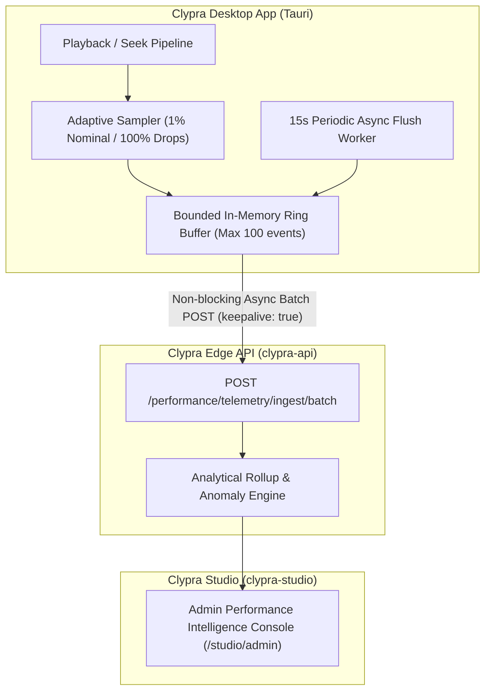

# Clypra Performance Telemetry & Privacy Specification

## 1. Purpose & Goals

The Clypra desktop video editor operates under strict hardware performance budgets:
- **60 FPS Timeline Playback**: Maximum budget of **16.6 ms (16,667 µs)** per frame.
- **Cold Keyframe Seek Latency**: Target **$\le 100\text{ ms}$** response time.
- **Dropped Frame Rate**: Target **$\le 0.5\%$** across long scrub sessions.

To ensure these Service Level Agreements (SLAs) are upheld across fragmented operating systems (macOS, Windows 10/11, Linux, iOS, Android) and hardware configurations (Apple Silicon, NVIDIA RTX, Intel Iris Xe, AMD Radeon, Qualcomm Snapdragon, ARM Mali), Clypra employs a lightweight, production-only telemetry collection architecture.

---

## 2. Zero-PII Privacy Guarantee

```
┌─────────────────────────────────────────────────────────────────────────┐
│                    ZERO-PII PRIVACY CONTRACT                            │
├─────────────────────────────────────────────────────────────────────────┤
│ ❌ NEVER COLLECTED:                                                      │
│    • No video pixel buffers, audio samples, or image thumbnails.        │
│    • No file paths, project names, timeline track labels, or captions.  │
│    • No usernames, email addresses, IP addresses, or location data.     │
│                                                                         │
│ ✅ STRICTLY NUMERICAL & ANONYMOUS:                                      │
│    • Stage render timings (decode µs, compose µs, total frame µs).      │
│    • Seek latency durations (ms) and dropped frame ratios.              │
│    • General hardware context (OS family, CPU cores, GPU model, DPR).   │
│    • High-level video profile (codec, resolution bucket, bit depth).    │
└─────────────────────────────────────────────────────────────────────────┘
```

---

## 3. Architecture & Data Flow



---

## 4. Adaptive Sampling Algorithm

To ensure telemetry collection imposes **0% CPU / frame pacing overhead**:
1. **Nominal 60 FPS Frames** (Render time $\le 16.6\text{ ms}$, 0 dropped frames):
   - Sampled at **1%** probability via pseudo-random number generator (`Math.random() < 0.01`).
2. **Performance Anomalies & Edge Cases** (Dropped frames $> 5\%$, frame time $> 16.6\text{ ms}$, or seek latency $> 100\text{ ms}$):
   - Sampled at **100%** rate to ensure complete visibility into hardware stalls.
3. **Hardware Fallbacks** (WebGPU $\to$ WebGL, HW Decoder $\to$ SW FFmpeg):
   - Sampled at **100%** and flushed immediately.

---

## 5. Telemetry Payload Schema

```typescript
export interface TelemetryEvent {
  eventId: string;
  appVersion: string;         // e.g. "1.4.4"
  appEnvironment: "production" | "canary" | "beta";
  device: {
    osFamily: "macos" | "windows" | "linux" | "ios" | "android";
    osVersion: string;
    cpuArch: "arm64" | "x86_64";
    cpuCores: number;
    systemMemoryMb: number;
    gpuVendor: "apple" | "nvidia" | "amd" | "intel" | "arm" | "qualcomm";
    gpuModel: string;         // e.g. "Apple M3 Pro", "Intel Iris Xe Graphics"
    graphicsBackend: "metal" | "d3d12" | "vulkan" | "webgpu" | "webgl2";
    displayDpr: number;
  };
  video: {
    container: "mp4" | "mov" | "webm";
    codec: "h264" | "hevc" | "av1" | "vp9" | "prores422";
    resolutionBucket: "720p" | "1080p" | "1440p" | "4k" | "8k";
    nominalFps: number;       // e.g. 60.0
    bitDepth: 8 | 10 | 12;
  };
  workload: {
    mode: "playback" | "seek-cold" | "seek-warm" | "scrub" | "export-transcode";
    durationMs: number;
    totalFrames: number;
    droppedFrames: number;
    droppedFramesRatio: number;
    stageTimings: {
      decodeUs?: number;
      conversionUploadUs?: number;
      composeUs?: number;
      submitPresentUs?: number;
      totalTimeUs: number;
    };
  };
  fallbackEvent?: {
    triggered: boolean;
    fromBackend: string;
    toBackend: string;
    reasonCode: string;
  };
  timestampMs: number;
}
```

---

## 6. Where to View Analytics

- **Clypra Studio Admin Console**: Access [`https://studio.clypra.abdulkabirmusa.com/studio/admin`](https://studio.clypra.abdulkabirmusa.com/studio/admin) to view the Cross-OS performance matrix, GPU bottleneck rankings, and isolated edge cases.
- **REST API Reference**: Query metrics directly via `GET /performance/comparison/os` and `GET /performance/edge-cases/anomalies` on `clypra-api`.
